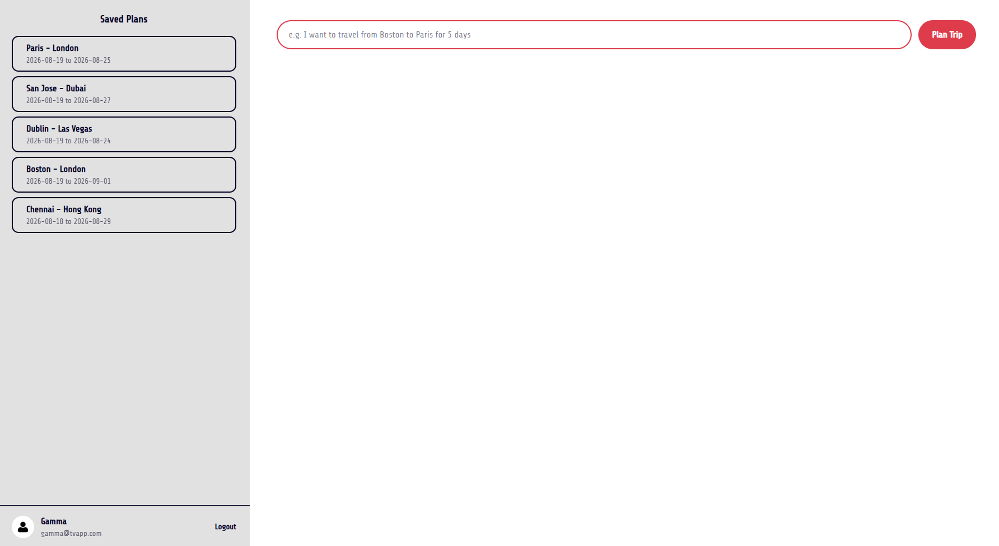
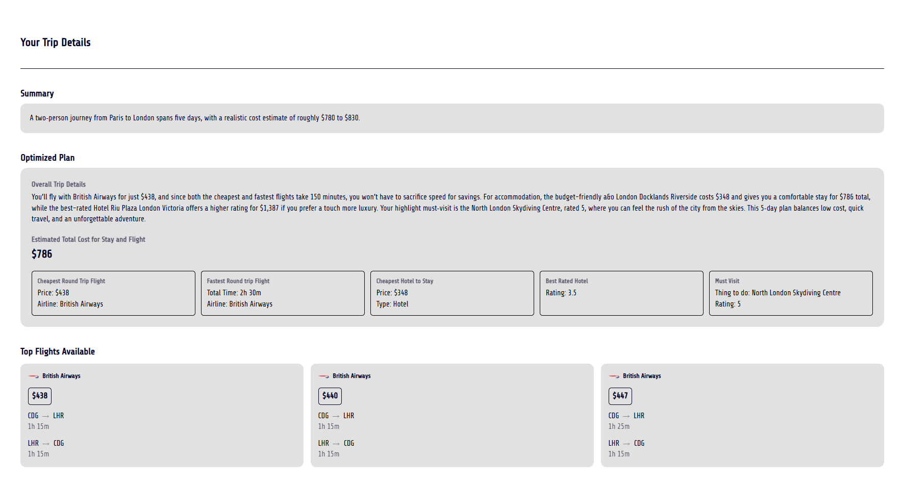
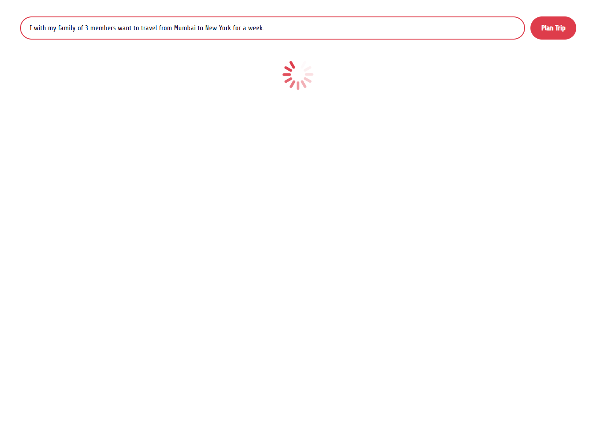
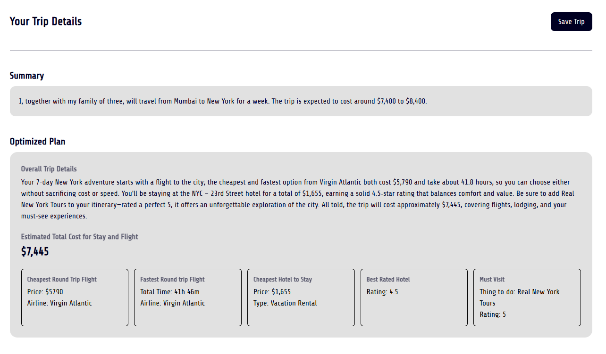
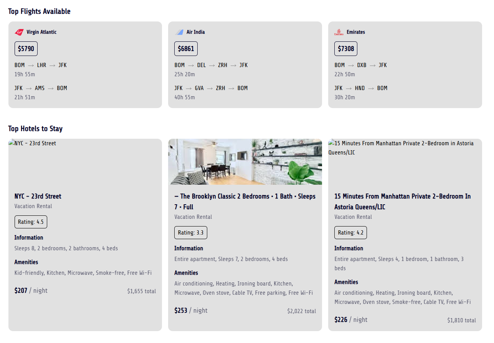
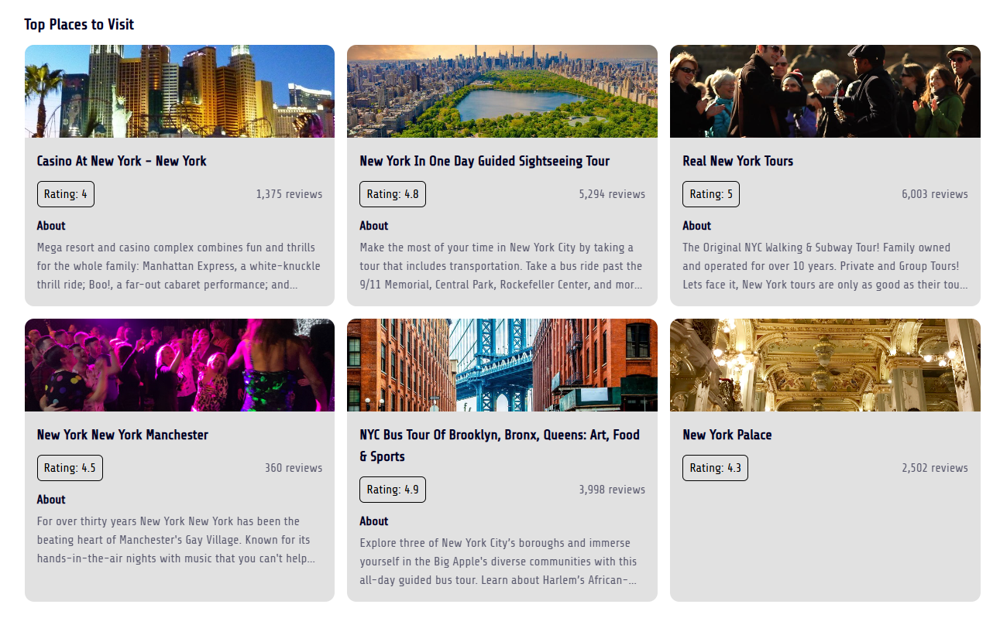

# TripWaves AI Travel App 🌍✈️

An AI-powered travel planning web app. Describe your trip in plain language — TripWaves extracts the details, finds flights, hotels, and places to visit, then builds an optimized plan with a written summary.

> Example prompt: A family of 4 planned a week-long trip from New York to Tokyo.

## Table of Contents

- [Features](#features)
- [Tech Stack](#tech-stack)
- [Getting Started](#getting-started)
- [API Overview](#api-overview)
- [Database Schema](#database-schema)
- [Screenshots](#screenshots)


## Features

- 🧠 **Natural language trip input** — describe your trip like you'd tell a friend
- ✈️ **Real flight, hotel, and places data** via SerpApi
- 🔀 **Parallel data fetching** using LangGraph (flights, hotels, places fetched concurrently)
- 📊 **Optimized recommendations** — cheapest flight, fastest flight, cheapest hotel, best-rated hotel, must-visit place, and an estimated total cost
- ✍️ **AI-generated trip narrative and summary**
- 💾 **Save and revisit trips** — trip history per user
- 🐳 **Fully Dockerized** — backend, frontend, and database run via Docker Compose


## Tech Stack

**Backend**
- [FastAPI](https://fastapi.tiangolo.com/) — Python web framework
- [LangGraph](https://langchain-ai.github.io/langgraph/) — orchestrates the trip-planning pipeline
- [Groq](https://groq.com/) — LLM inference (currently using `openai/gpt-oss-20b`)
- [SerpApi](https://serpapi.com/) — flights, hotels, and places data
- [SQLAlchemy](https://www.sqlalchemy.org/) + [PostgreSQL](https://www.postgresql.org/) — database

**Frontend**
- [React](https://react.dev/) + [TypeScript](https://www.typescriptlang.org/)
- [Tailwind CSS](https://tailwindcss.com/) — styling
- [React Router](https://reactrouter.com/) — routing
- [Axios](https://axios-http.com/) — API calls

**Infrastructure**
- [Docker](https://www.docker.com/) + Docker Compose — containerization


## Getting Started

**Environment Variables**

Create a `.env` file at the **project root** (same level as `docker-compose.yml`):

```dotenv
# --- LLM ---
GROQ_API_KEY=your_groq_api_key_here
LLM_MODEL_NAME=openai/gpt-oss-20b

# --- SerpApi ---
SERPAPI_KEY=your_serpapi_key_here

# --- Database ---
POSTGRES_USER=postgres
POSTGRES_PASSWORD=your_db_password
POSTGRES_DB=tripdb
POSTGRES_HOST=db
POSTGRES_PORT=5432
```

**Running with Docker**

From the project root:

```bash
docker compose up --build
```

Then:
- Frontend: [http://localhost:3000](http://localhost:3000)
- Backend docs (Swagger UI): [http://localhost:8000/docs](http://localhost:8000/docs)

For the first time you run this:

```bash
docker compose exec backend python -m app.database.create_tables
```

## API Overview

| Method | Endpoint                        | Description                              |
|--------|----------------------------------|-------------------------------------------|
| POST   | `/trip/plan`                     | Runs the LangGraph pipeline for a prompt |
| POST   | `/trip/save`                     | Saves a planned trip to the database  |
| GET    | `/trip/{trip_id}`                | Fetch a single saved trip                |
| GET    | `/trip/history/{user_id}`        | Fetch all saved trips for a user         |
| POST   | `/auth/signup`                   | Create a new user account                |
| POST   | `/auth/check`                    | Verify login credentials                 |

## Database Schema

**users**
| Column           | Type      |
|------------------|-----------|
| id               | int (PK)  |
| name             | string    |
| email            | string    |
| hashed_password  | string    |
| created_at       | datetime  |

**trips**
| Column                | Type      |
|-----------------------|-----------|
| id                    | int (PK)  |
| user_id               | int (FK → users.id) |
| user_prompt           | text      |
| origin                | string    |
| destination           | string    |
| people                | int       |
| days                  | int       |
| start_date            | date      |
| end_date              | date      |
| summary               | text      |
| flights_json          | JSONB     |
| hotels_json           | JSONB     |
| places_json           | JSONB     |
| optimized_plan_json   | JSONB     |
| created_at            | datetime  |

## Screenshots








